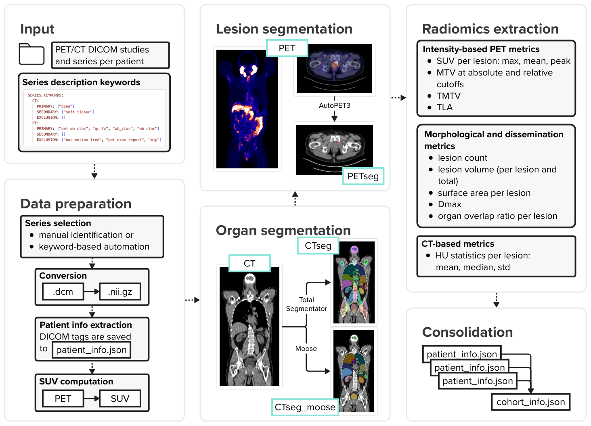

# MUSIQ - Multimodal Unified Segmentation & Image Quantification 

This Python project provides an end-to-end pipeline for processing PET/CT and MRI scans retrieved from a PACS system. The pipeline supports DICOM to NIfTI conversion, segmentation, radiomics extraction, tumor quantification, and result aggregation.

---

## Features


1. **Interactive Series Selection & Conversion**
   - Allows interactive selection of PET and CT series per patient.
   - Converts DICOM series to NIfTI:
     - `CT.nii` – Original CT scan as NIfTI
     - `PET.nii` – Original PET scan as NIfTI
     - `SUV.nii` – Standardized Uptake Value image as NIfTI
     - `patient_info.json` - Dictionary with patient, study and serie information
     - `validation_results.csv` - List of studies flagged by user

2. **PET Segmentation with AutoPET3**
   - Segments PET scans using AutoPET3.
   - Output:
      - `CTres.nii`
      - `PETseg.nii`
      - Expands `patient_info.json` with serie information

3. **CT Segmentation with TotalSegmentator**
   - Performs organ segmentation on CT images using TotalSegmentator.
   - Outputs:
     - `CTseg.nii` – Segmentation mask
     - Expands `patient_info.json` with TS information

4. **CT Segmentation with Moose**
   - Performs organ segmentation on CT images using Moose.
   - Moose can only take one CT per series.
   - Outputs:
     - `CTmoose_organs.nii` – Segmentation mask
     - Expands `patient_info.json` with Moose information

5. **Radiomics Extraction**
   - Computes key radiomics metrics from PET and CT scans.
   - Output: Extension of `patient_info.json`
      - SUV (mean, max, peak median, std)
      - Lesion count
      - Total Metabolic Tumor Volume (TMTV)
      - Total Metabolic Tumor Volume (TMTV) with thresholds
         - 0.3, 0.4, 0.41, 0.5, 2.5, 3.0, 3.5, 4.0
      - Total Lesion Glycolysis (TLG)
      - Tumor Dissemination (Dmax)
      - Tumor Dissemination standardized by patient's height and weight(SDmax)
      - Surface Area

6. **Tumor Size Analysis**
   - Quantifies tumor volume per organ based on segmentations.
   - Output:
      - `CTsegres.nii` – Resampled segmentation mask to PT
      - extension of `patient_info.json`
         - Volume
         - Organ overlap
         - SUV (mean, max, peak median, std)
         - Surface area

7. **Optional Plotting**
   - Generates visualizations

---

## Output
Each patient folder includes:
- `CT.nii`
- `PET.nii`
- `SUV.nii`
- `CTres.nii`
- `PETseg.nii`
- `CTseg.nii`
- `CTsegres.nii`
- `patient_info.json`
- `CTmoose_organs.nii`
- Plots

Summary for the whole cohort:
- `validation_results.csv`
- `cohort_results.json`

---

## Directory Structure

Eventually, the project and its output are structured as follows:

```
musiq/
├── autopet-3-submission/          # Cloned AutoPET3 repository
├── autopet-3-model/               # Downloaded AutoPET3 checkpoints
├── data/                          # Can be anywhere in your file system
│   ├── raw/                       # Raw DICOM files from PACS
│   │   ├── patient_id/
│   │   │   ├── study_id/
│   │   │   │   ├──series_id-1/
│   │   │   │   ├──series_id-2/
│   ├── processed/
│   │   ├── patient_id/
│   │   │   ├── plots/
│   │   │   ├──series_id-1/
│   │   │   │   ├── CT.json                     # CT DICOM tags
│   │   │   │   ├── CT.nii                      # CT converted to nifti
│   │   │   │   ├── CTmoose_organs.nii          # CT segmentation by Moose
│   │   │   │   ├── CTres.nii                   # CT resampled to PET resolution
│   │   │   │   ├── CTseg.json                  # CT segmentation metadata from totalsegmentator
│   │   │   │   ├── CTseg.nii                   # CT segmentations from totalsegmentator
│   │   │   │   ├── PET.nii                     # PET converted to nifti
│   │   │   │   ├── PETseg.nii                  # PET segmentations from AutoPET3
│   │   │   │   ├── SUV.nii                     # SUV map from PET
│   │   │   ├──series_id-2/
│   │   │   │   ├── ...
│   │   │   ├── patient_info.json
│   │   ├── cohort_info.json
│   │   ├── validation_results.csv
├── src/
├── pyproject.toml
├── setup.py
├── README.md
├── requirements.txt
├── requirements_moose.txt

```

---
## Usage
- Clone this repository and cd into it
- Create the first virtual enviroment (tested with Python3.12) and install dependencies via the following commands:

```bash
python3.12 -m venv .venv
source .venv/bin/activate
git clone https://github.com/mic-dkfz/autopet-3-submission
curl -L -o autoPET-3-LesionTracer.zip "https://zenodo.org/records/14007247/files/autoPET-3-LesionTracer.zip?download=1"
unzip autoPET-3-LesionTracer.zip -d ./autopet-3-model/
rm autoPET-3-LesionTracer.zip
pip install -r requirements.txt
```

- In order to use the pipeline with the moose extention we need a second virtual enviroment:

```bash
deactivate
python3.12 -m venv .venv_moose
source .venv_moose/bin/activate
pip install -r requirements_moose.txt
pip install moosez --no-deps
```

- To start the whole workflow run:
```bash
musiq --input-dirpath /data/raw --output-dirpath /data/processed --tasks series_selection radiomics autopet totalsegmentator tumor moose
```
- See `pyproject.toml` to see commands for running only parts of the pipeline in a modular way.


- For development also install pre-commit hooks via
```bash
pip install pre-commit
pre-commit install
```
---

## Acknowledgements
- **AutoPET3**
   - Isensee, F., Jaeger, P. F., Kohl, S. A., Petersen, J., & Maier-Hein, K. H. (2021). nnU-Net: a self-configuring method for deep learning-based biomedical image segmentation. Nature methods, 18(2), 203-211.
- **TotalSegmentator**
   - Wasserthal, J., Breit, H. C., Meyer, M. T., Pradella, M., Hinck, D., Sauter, A. W., ... & Segeroth, M. (2023). TotalSegmentator: robust segmentation of 104 anatomic structures in CT images. Radiology: Artificial Intelligence, 5(5), e230024.
- **Moose 3.0**
   - Ferrara D, Pires M, Gutschmayer S, Yu J, Abdelhafez YG, Abenavoli E et al. Sharing a whole-/total-body [18F]FDG-PET/CT dataset with CT-derived segmentations: an ENHANCE.PETinitiative. 2025.
   - Sundar LKS, Yu J, Muzik O, Kulterer OC, Fueger B, Kifjak D et al. Fully Automated,Semantic Segmentation of Whole-Body18 F-FDG PET/CT Images Based on Data-CentricArtificial Intelligence. J Nucl Med. 2022;63(12):1941–8.

---

## Reference
The corresponding paper **"AI-Based Automated Framework for Quantitative PET/CT Image Analysis"** was accepted at Bildverarbeitung für die Medizin (BVM) 2026 and will soon be published in the proceedings of the German Conference on Medical Image Computing,
Regensburg, March 15-17, 2026.