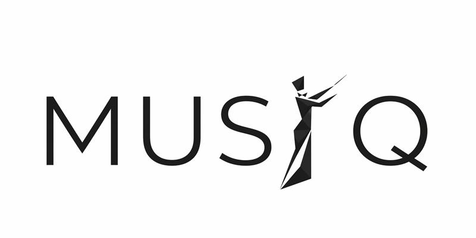

# Multimodal Unified Segmentation & Image Quantification

This Python project provides an end-to-end pipeline for processing PET/CT and MRI scans retrieved from a PACS system. The pipeline supports DICOM to NIfTI conversion, segmentation, radiomics extraction, tumor quantification, and result aggregation.

---

## Features


1. **Interactive Series Selection & Conversion**
   - Allows interactive selection of PET and CT series per patient.
   - Converts DICOM series to NIfTI:
     - `CT.nii.gz` – Original CT scan as NIfTI
     - `PET.nii.gz` – Original PET scan as NIfTI
     - `SUV.nii.gz` – Standardized Uptake Value image as NIfTI
     - `patient_info.json` - Dictionary with patient, study and serie information
     - `validation_results.csv` - List of studies flagged by user

2. **CT Segmentation with TotalSegmentator**
   - Performs organ segmentation on CT images using TotalSegmentator.
   - Outputs:
     - `CTseg.nii.gz` – Segmentation mask
     - Expands `patient_info.json` with TS information

3. **CT Body Composition Analysis with TotalSegmentator for SUL computation**
   - Performs muscle and fat segmentation using TotalSegmentator and compute a SUL image.
   - Outputs:
      - `CT_muscle_fat.nii.gz` - Muscle and fat CT segmentation
      - `MRI_muscle_fat.nii.gz` - Muscle and fat MRI segmentation
      - `SUL.nii.gz` - SUV image corrected by using the lean body mass
      - Expands `patient_info.json` with muscle, fat, and SUL information

4. **PET Segmentation with AutoPET3**
   - Segments PET scans using AutoPET3.
   - Output:
      - `CTres.nii.gz`
      - `PETseg.nii.gz` - SUV segmentations by AutoPET3
      - `PETsegSUL.nii.gz` - SUL segmentations by AutoPET3
      - Expands `patient_info.json` with series information

5. **CT Segmentation with CADS v1.0.0**
   - Performs organ segmentation on CT images using the CADS model using the specified tasks and saves everything to a single file. The labels are set as the labelmap_all_structure  as shown here https://github.com/murong-xu/CADS/tree/main/cads/dataset_utils.
   - Output:
      - `CTcads.nii.gz`
      - Expands `patient_info.json` with CADS information


6. **CT Segmentation with Moose**
   - Performs organ segmentation on CT images using Moose.
   - Moose can only take one CT per series.
   - Outputs:
     - `CTmoose_organs.nii.gz` – Segmentation mask
     - Expands `patient_info.json` with Moose information

7. **Body Composition Analysis with BOA (BCA)**
   - Runs the UMEssen [Body-and-Organ-Analysis](https://github.com/UMEssen/Body-and-Organ-Analysis) BCA component on each `CT.nii.gz` via the `shipai/boa-cli` Docker image (no Python dependency added — BOA runs in its own container).
   - Reuses MUSIQ's existing `CTseg.nii.gz` as BOA's `total` segmentation when present, so the 104-organ TotalSegmentator step is not recomputed. Run `totalsegmentator` before `boa`. (MUSIQ pins TotalSegmentator 2.9.0 while BOA targets 2.12.0, but the `total` task's 117-class label map is identical across those versions, so the reused segmentation is labeled correctly. Disable reuse with `--boa-no-reuse-total` if you ever align both to a version where the map differs.)
   - Outputs (next to the other NIfTIs):
     - `CTbca_tissues.nii.gz` – tissue (SAT/VAT/muscle/bone) segmentation
     - `CTbca_body_regions.nii.gz` – body-region segmentation
     - `boa/` subfolder with BOA's `output.xlsx`, optional `report.pdf`, JSON measurements and logs
     - Expands `patient_info.json` with a `BCA` block and the segmentation paths

8. **Radiomics Extraction**
   - Computes key radiomics metrics from SUV or SUL and CT scans.
   - Output: Extension of `patient_info.json`
      - SUV or SUL (mean, max, peak median, std)
      - Lesion count
      - Total Metabolic Tumor Volume (TMTV)
      - Total Metabolic Tumor Volume (TMTV) with thresholds
         - 0.3, 0.4, 0.41, 0.5, 2.5, 3.0, 3.5, 4.0
      - Total Lesion Glycolysis (TLG)
      - Tumor Dissemination (Dmax)
      - Tumor Dissemination standardized by patient's height and weight(SDmax)
      - Surface Area

9. **Tumor Size Analysis**
   - Quantifies tumor volume per organ based on segmentations.
   - Output:
      - `CTsegres.nii.gz` – Resampled segmentation mask to PT
      - extension of `patient_info.json`
         - Volume
         - Organ overlap
         - SUV or SUL (mean, max, peak median, std)
         - Surface area

10. **Optional Plotting**
   - Generates visualizations

---

## Output
Each patient folder includes:
- `CT.nii.gz`
- `CTcads.nii.gz`
- `CTmoose_organs.nii.gz`
- `CTres.nii.gz`
- `CTseg.nii.gz`
- `CTsegres.nii.gz`
- `PET.nii.gz`
- `SUV.nii.gz`
- `SUL.nii.gz`
- `PETseg.nii.gz`
- `PETsegSUL.nii.gz`
- `patient_info.json`

Summary for the whole cohort:
- `validation_results.csv`
- `cohort_results.json`

---

## Directory Structure

Eventually, the project and its output are structured as follows:

```
musiq/
├── autopet-3-model/               # Downloaded AutoPET3 checkpoints
├── autopet-3-submission/          # Cloned AutoPET3 repository
├── CADS/                          # Downloaded CADS checkpoints
├── data/                          # Can be anywhere in your file system
│   ├── raw/                       # Raw DICOM files from PACS
│   │   ├── patient_id/
│   │   │   ├── study_id/
│   │   │   │   ├──series_id-1/
│   │   │   │   ├──series_id-2/
│   ├── processed/
│   │   ├── patient_id/
│   │   │   ├── plots/
│   │   │   ├── study_date_1/
│   │   │   │   ├── CT.nii.gz                      # CT converted to nifti
│   │   │   │   ├── CTbca_tissues.nii.gz           # CT tissue segmentation by BOA (BCA)
│   │   │   │   ├── CTbca_body_regions.nii.gz      # CT body-region segmentation by BOA (BCA)
│   │   │   │   ├── boa/                           # BOA outputs (xlsx, optional pdf, json, logs)
│   │   │   │   ├── CTcads.nii.gz                  # CT segmentation by CADS
│   │   │   │   ├── CTmoose_organs.nii.gz          # CT segmentation by Moose
│   │   │   │   ├── CTmuscle_fat.nii.gz            # CT muscle and fat segmentation by TotalSegmentator
│   │   │   │   ├── CTres.nii.gz                   # CT resampled to PET resolution
│   │   │   │   ├── CTseg.nii.gz                   # CT segmentations by TotalSegmentator
│   │   │   │   ├── PET.nii.gz                     # PET converted to nifti
│   │   │   │   ├── PETseg.nii.gz                  # SUV segmentations by AutoPET3
│   │   │   │   ├── PETsegSUL.nii.gz               # SUL segmentations by AutoPET3
│   │   │   │   ├── SUV.nii.gz                     # SUV map from PET
│   │   │   │   ├── SUL.nii.gz                     # SUL map from PET
│   │   │   ├── study_date_1/
│   │   │   │   ├── t1_cor.nii.gz                  # MRI converted to nifti (exemplary)
│   │   │   │   ├── t1_cor_muscle_fat.nii.gz       # MRI muscle and fat segmented by TotalSegmentator
│   │   │   │   ├── t1_cor_seg.nii.gz              # MRI segmented by TotalSegmentator
│   │   │   ├── patient_info.json
│   │   ├── cohort_info.json
│   │   ├── validation_results.csv
├── src/
├── pyproject.toml
├── setup.py
├── README.md
├── requirements.txt
├── requirements_moose.txt

```

---
## Standard Usage
- Clone this repository and cd into it
- Create the first virtual environment (tested with Python3.12) and install dependencies via the following commands:

```bash
python3.12 -m venv .venv
source .venv/bin/activate
git clone https://github.com/mic-dkfz/autopet-3-submission
curl -L -o autoPET-3-LesionTracer.zip "https://zenodo.org/records/14007247/files/autoPET-3-LesionTracer.zip?download=1"
unzip autoPET-3-LesionTracer.zip -d ./autopet-3-model/
rm autoPET-3-LesionTracer.zip
git clone https://github.com/murong-xu/CADS.git
pip install -r requirements.txt
pip install TPTBox==0.3.0 fastremap fill_voids --no-deps
```
- For the TotalSegmentator muscle and fat segmentation the TS license needs to be set:
```bash
totalseg_set_license -l aca_...
```
- In order to use the pipeline with the moose extension we need a second virtual enviroment:

```bash
deactivate
python3.12 -m venv .venv_moose
source .venv_moose/bin/activate
pip install -r requirements_moose.txt
pip install moosez --no-deps
```

- The `boa` task runs in Docker, so it needs no virtual environment — just pull the image once (an NVIDIA GPU + Container Toolkit are required):
```bash
docker pull shipai/boa-cli
```
  Optionally download the BOA/TotalSegmentator weights to a local directory and pass it via `--boa-weights-path` (otherwise BOA downloads them on first run). Run `totalsegmentator` before `boa` so the existing `CTseg.nii.gz` is reused as BOA's `total` segmentation (disable with `--boa-no-reuse-total`).

- To start the whole workflow run:
```bash
musiq --input-dirpath /data/raw --output-dirpath /data/processed --tasks series_selection radiomics autopet totalsegmentator tumor moose cads boa --cads-tasks 556 558
```
- To run CADS you can run the different tasks given on their repository or just run 'all'
- See `pyproject.toml` to see commands for running only parts of the pipeline in a modular way.


- For development also install pre-commit hooks via
```bash
pip install pre-commit
pre-commit install
```

---
## Docker Usage
- Clone this repository and `cd` into it.
- Make sure **Docker ≤ 19.03** is installed and running.
  - For **Windows**, use Docker Desktop 4.37.1 or later and enable WSL integration.
- An **NVIDIA GPU** is required.
- **NVIDIA Container Toolkit** must be installed and configured for Docker (not required on Windows).
  Installation guide: [https://docs.nvidia.com/datacenter/cloud-native/container-toolkit/install-guide.html](https://docs.nvidia.com/datacenter/cloud-native/container-toolkit/install-guide.html)

Before running the pipeline, replace:
- `path/to/inputdir` with the path to your input directory
- `path/to/outputdir` with the path to your output directory

```bash
docker build -t musiq_image .

docker run -it --rm --gpus all --name musiq_container \
  -v "path/to/inputdir:/data/input" \
  -v "path/to/outputdir:/data/output" \
  musiq_image musiq \
  --input-dirpath /data/input \
  --output-dirpath /data/output \
  --tasks series_selection radiomics autopet totalsegmentator tumor moose
```
If you are using Windows, it is recommended to add the following flags to reduce resource usage:
```bash
--shm-size=8g -e NNUNET_n_proc_preprocessing=1 -e NNUNET_n_proc_DA=1
```

---
## Acknowledgements
- **AutoPET3**
   - Isensee, F., Jaeger, P. F., Kohl, S. A., Petersen, J., & Maier-Hein, K. H. (2021). nnU-Net: a self-configuring method for deep learning-based biomedical image segmentation. Nature methods, 18(2), 203-211.
- **TotalSegmentator**
   - Wasserthal, J., Breit, H. C., Meyer, M. T., Pradella, M., Hinck, D., Sauter, A. W., ... & Segeroth, M. (2023). TotalSegmentator: robust segmentation of 104 anatomic structures in CT images. Radiology: Artificial Intelligence, 5(5), e230024.
- **Moose 3.0**
   - Ferrara D, Pires M, Gutschmayer S, Yu J, Abdelhafez YG, Abenavoli E et al. Sharing a whole-/total-body [18F]FDG-PET/CT dataset with CT-derived segmentations: an ENHANCE.PETinitiative. 2025.
   - Sundar LKS, Yu J, Muzik O, Kulterer OC, Fueger B, Kifjak D et al. Fully Automated,Semantic Segmentation of Whole-Body18 F-FDG PET/CT Images Based on Data-CentricArtificial Intelligence. J Nucl Med. 2022;63(12):1941–8.
- **CADS**
   - Xu, M., Amiranashvili, T., Navarro, F., Fritsak, M., Hamamci, I.E., Shit, S., Wittmann, B., Er, S., Christ, S.M., de la Rosa, E. and Deseoe, J., 2025. CADS: A Comprehensive Anatomical Dataset and Segmentation for Whole-Body Anatomy in Computed Tomography. arXiv preprint arXiv:2507.22953.
- **BOA (Body and Organ Analysis)**
   - Haubold, J., Baldini, G., Parmar, V., Schaarschmidt, B.M., Koitka, S., Kroll, L., van Landeghem, N., Umutlu, L., Forsting, M., Nensa, F. and Hosch, R., 2024. BOA: A CT-Based Body and Organ Analysis for Radiologists at the Point of Care. Investigative Radiology, 59(6), pp.433-441. https://github.com/UMEssen/Body-and-Organ-Analysis
---

## Reference
If you use our pipeline, please cite:

```bibtex
@inproceedings{adomeit2026ai,
  title={AI-based Automated Framework for Quantitative PET/CT Image Analysis},
  author={Adomeit, Sonja and F{\"o}rner, Lukas and Scheurer, Elisabeth and B{\"a}{\ss}ler, Jan and de Llanes, Elina Gastreich and B{\"o}hringer, Jonas and Bundschuh, Ralph A and Lapa, Constantin and Tehlan, Kartikay and Wendler, Thomas},
  booktitle={BVM Workshop},
  pages={139--145},
  year={2026},
  organization={Springer}
}
```
